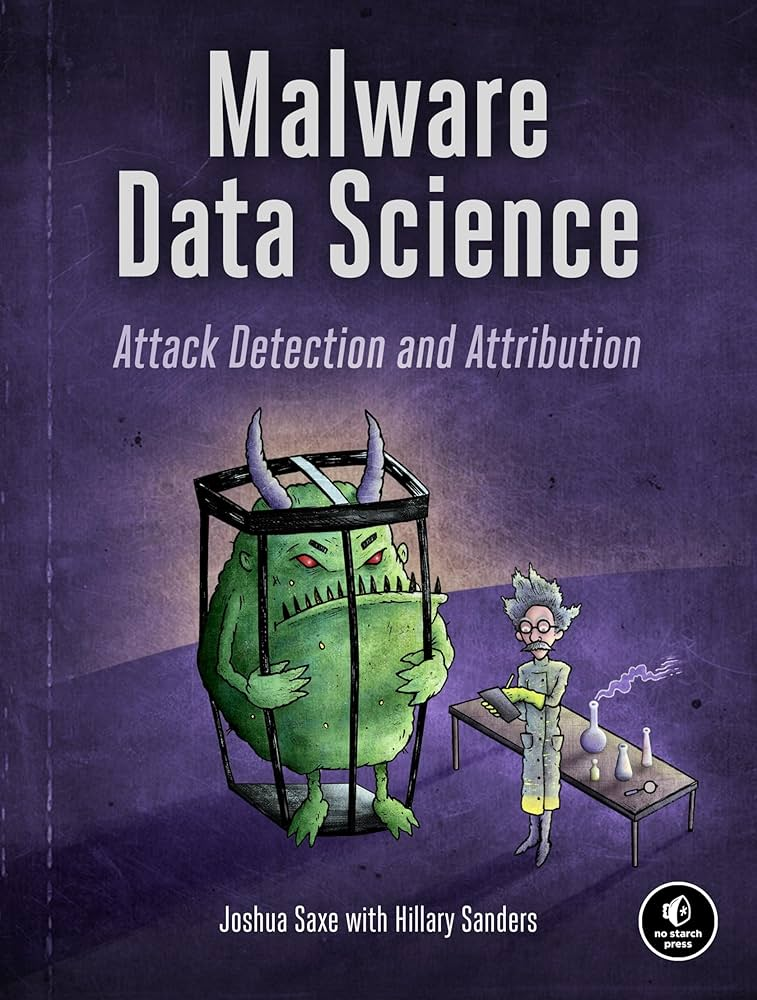

# Welcome to My GitHub Profile

## 🔬 Machine Learning Projects
### **MIT xPro** - Deep Learning: Mastering Neural Networks

- [Regression Optimization](https://github.com/sassom2112/module_1_regression_optimization) - A project that explores manually fitting vs automatic fitting using gradient descent optimization for linear regression.
- [Training a Single Neuron Classifier](https://github.com/sassom2112/fuzzy-palm-tree.git) - A project that addresses a binary classification problem, predicting wine color (red or white) based on chemical features like acidity and alcohol content. It compares two approaches: manual implementation vs. scikit-learn, demonstrating the convenience and efficiency of using pre-built machine learning tools.
- [Other Project 3](#) - Description of another project.

## **MIT** 6.S191 - Introduction to Deep Learning

- [Other Project 1](#) - Description of another project.
- [Other Project 2](#) - Description of another project.
- [Other Project 3](#) - Description of another project.

## Violent Python Projects
 

- [Password Cracker](https://github.com/sassom2112/ideal-rotary-phone.git) - A project that demonstrates unix_crypt(3) and modern SHA512 salting approaches. Highlights the importance of strong hashing and salting practices.
- [TCP Scanner](https://github.com/sassom2112/shiny-octo-happiness.git) - A project that demostrates how to scan TCP ports on a target host and retrieve service banners from open ports. It highlights the importance of network reconnaissance techniques for identifying open services and securing network infrastructure.
- [Other Project 3](#) - Description of another project.

## Malware Data Science Projects
 

- [Other Project 1](#) - Description of another project.
- [Other Project 2](#) - Description of another project.
- [Other Project 3](#) - Description of another project.

## C Projects

- [Windows Memory Management](https://github.com/sassom2112/Windows-Memory-Management) - A project that demostrates the significance in properly freeing memory to prevent leaks.
- [Other Project 2](#) - Description of another project.
- [Other Project 3](#) - Description of another project.
