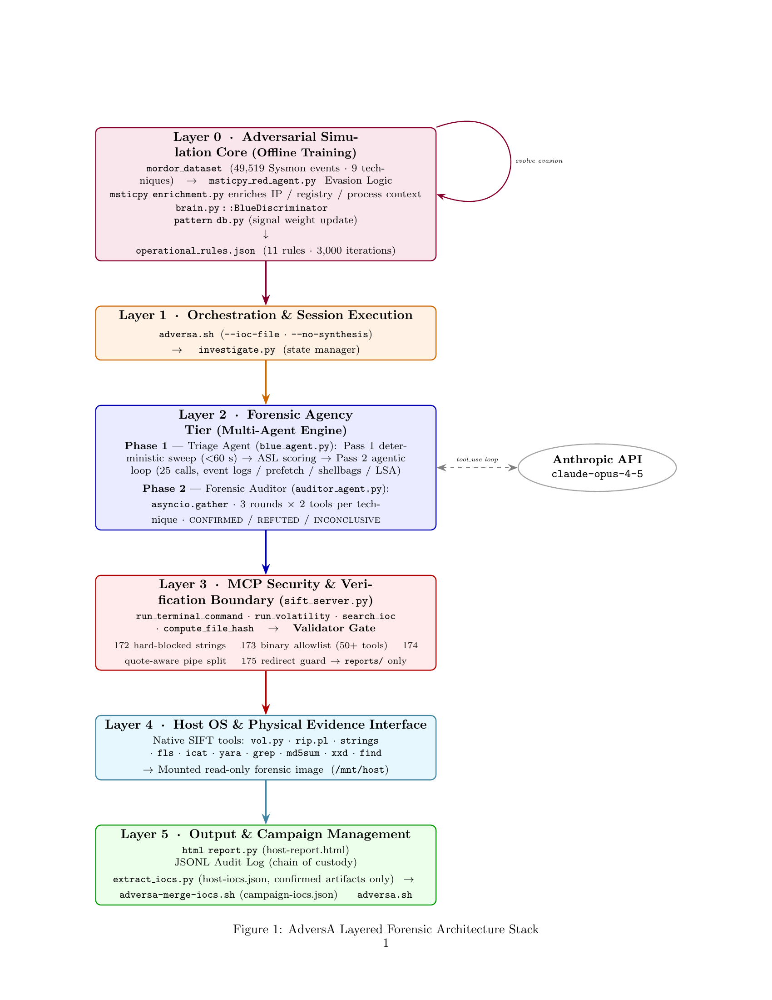
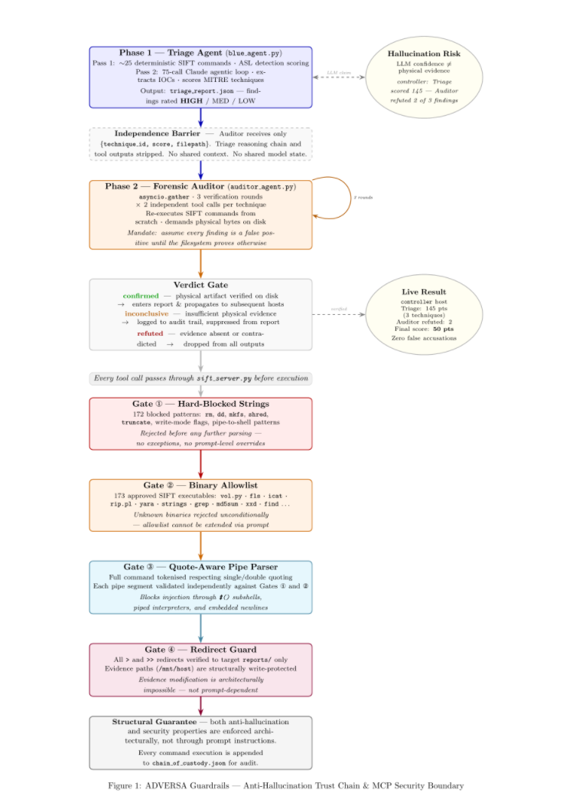
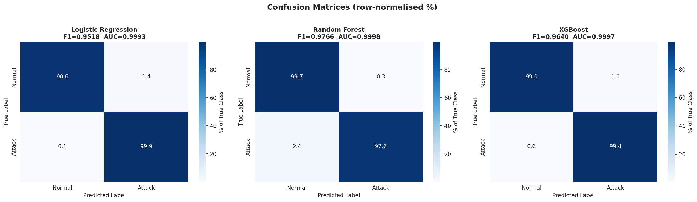
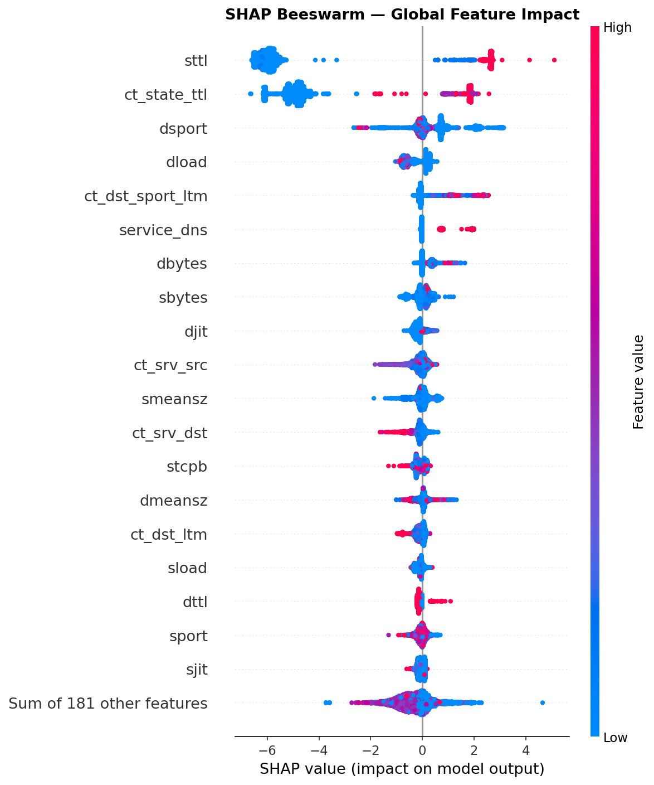
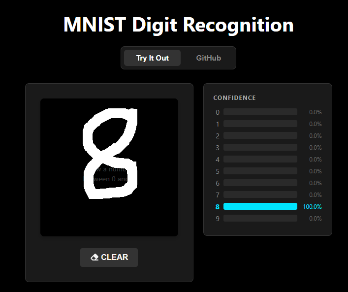
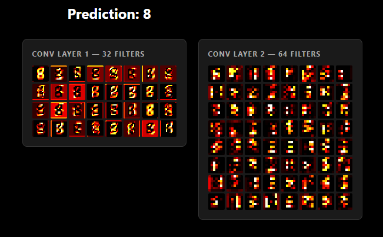
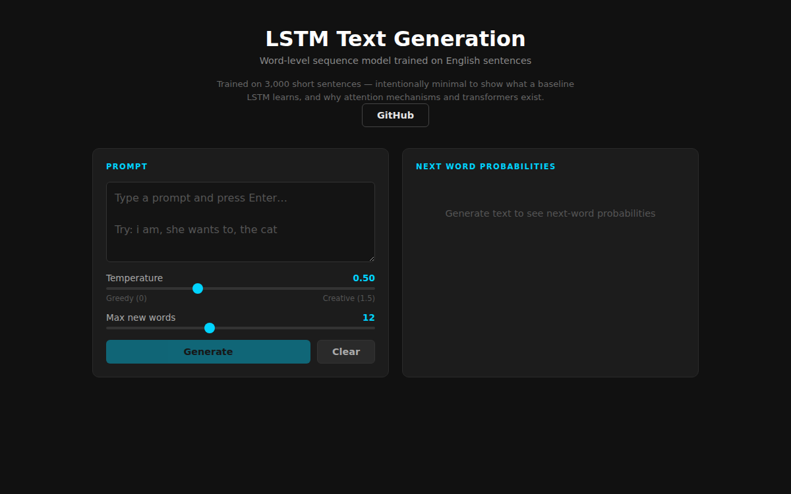
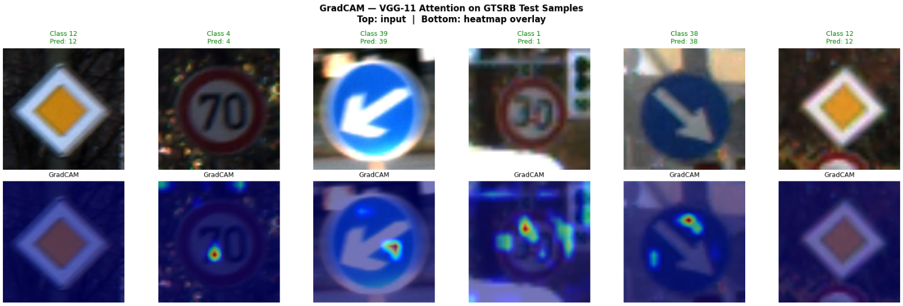

# Security Researcher · Agentic AI Engineer · Data Scientist

> Offensive security meets adversarial ML — building systems that think, investigate, and defend.
> I build MCP tool servers, dual-agent forensic pipelines, and production ML systems with real results.

---

## 🛠️ Autonomous DFIR & Agentic SecOps Ecosystem

### [Sift Forensics Agent](https://github.com/sassom2112/adversa)
*SANS FIND EVIL! Hackathon 2026*

**MCP | Windows Forensics | Red/Blue Loop**

- Dual-agent AI that autonomously investigates Windows disk images for compromise — then audits its own findings
- Red vs. Blue adversarial loop with live self-correction: no human intervention required
- 1,245 evasion variants evolved across training; 83 detection signals learned from scratch

  
  

> LLMs hallucinate. In forensics, a hallucination is a false accusation. I built a tool that is defensible.

---

### [Splunk IR Agent](https://github.com/sassom2112/splunk-agentic-ir)
*Splunk Agentic Ops Hackathon 2026*

**Splunk | MITRE ATT&CK | Python**

- End-to-end autonomous incident investigation triggered by a single alert
- Detects brute force, lateral movement, and credential access across Splunk data
- Maps every finding to MITRE ATT&CK and generates analyst-ready IR reports automatically

---

### [Elastic IR Agent](https://github.com/sassom2112/elastic-ir-agent)
*Elastic Agent Builder × Google Cloud Agent Builder Hackathon 2026*

**Elasticsearch | Gemini | ES|QL**

- Autonomous IR agent with hybrid semantic search over security event data
- ES|QL analytics pipeline for structured threat correlation at query time
- Write-back memory builds persistent investigation context across sessions

---

## 🔐 Security Research

### [UNSW-NB15 Intrusion Detection](https://github.com/sassom2112/network-intrusion-detection)

**sklearn | XGBoost | SHAP**

- Full ML lifecycle on 2.54M real network flows — EDA → sklearn Pipeline → XGBoost → SHAP
- **F1: 0.9640 · ROC-AUC: 0.9997**

---

## 🤖 ML / AI / Data Science

### Live: MNIST Digit Recognition App

**[MNIST Hand Written Digit Recognition](https://github.com/sassom2112/mnist-digit-recognition)** · 

Draw a digit on the canvas → Flask API preprocesses and runs it through a PyTorch CNN → per-digit confidence scores returned instantly. The app also visualizes activated filters from Conv Layer 1 (32 filters) and Conv Layer 2 (64 filters) in real time — you see exactly what the network sees as it classifies your stroke. Deployed on AWS (Lambda + API Gateway + CloudFront), containerized with Docker.

 

---

### Live: LSTM Text Generation App

**[LSTM Text Prediction](https://github.com/sassom2112/lstm-text-prediction)** · 

Type a prompt → Flask API runs it through a two-layer PyTorch LSTM → top-10 next-word probabilities returned as live confidence bars. Intentionally trained on 3,000 short sentences to show what a baseline LSTM learns — and why attention mechanisms and transformers exist. Includes full EDA, perplexity tracking, hidden state magnitude visualization, and temperature-controlled generation. Deployed on Render, frontend on GitHub Pages.

---

**MIT xPro — Deep Learning: Mastering Neural Networks** 

### [Fashion-MNIST CNN — Adversarial Robustness](https://github.com/sassom2112/fashionmnist-cnn)

GradCAM explainability + FGSM adversarial attack on a 10-class garment classifier. **Test Acc: 82.3%** · Shirt collapses 41% → 4% at ε=0.10. Pullover/Coat cluster is the dominant adversarial weakness.

### [VGG-11 Traffic Sign Classification — Adversarial Robustness](https://github.com/sassom2112/vgg11-traffic-sign-classifier)

**PyTorch | Transfer Learning | GradCAM | FGSM**

Two-phase fine-tuning of pretrained VGG-11 on GTSRB (43 classes, 39K images). Phase 1 freezes the ImageNet backbone — test accuracy: 63.9%. Phase 2 unfreezes all layers — test accuracy: **93.2%**. The 29-point gap reveals how much the traffic sign domain diverges from ImageNet.

GradCAM on the fine-tuned model exposes a shortcut learning failure: the 30 km/h classifier fires on background traffic lights, not the sign itself — the model learned urban intersection context as a proxy for speed limits. That's the attack surface.

| Project | What it is |
|---------|-----------|
| [GAN: Oxford Flowers Synthesis](https://github.com/sassom2112/oxford-flowers-gan) | Adversarial training on Oxford 102 Flowers. Generator vs. Discriminator until indistinguishable. |
| [Wine Color Classification + Adversarial Analysis](https://github.com/sassom2112/wine-color-classifier) | EDA → LR vs XGBoost → SHAP → FGSM adversarial attack on 6,497 samples. **F1: 0.9938 · ROC-AUC: 0.9999.** Minimum perturbation to fool the classifier: +0.09 mg/L SO₂. |
| [Gradient Descent from Scratch](https://github.com/sassom2112/regression-optimization) | Manual fitting vs. autograd. What optimizers actually do, no black box. |

---

