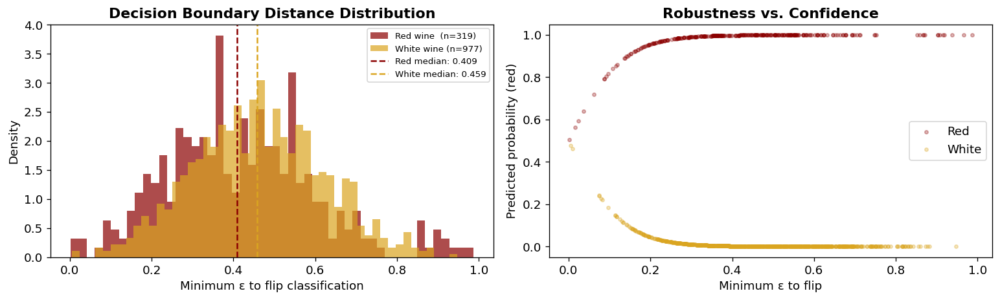
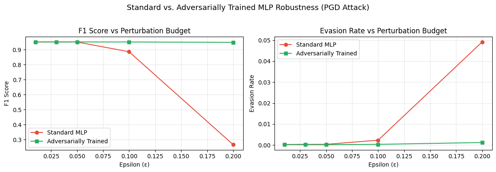

# Adversarial ML Researcher · AI Red Teamer · Agentic Security Engineer

## Adversarial ML

**Fashion-MNIST CNN**

FGSM at ε=0.10 drops accuracy from 82% to 4%.

*GradCAM activations across all 10 classes.*

*Per-class accuracy under FGSM attack.*

**VGG-11 Traffic Sign Classification**

Fine-tuned to 93.2% on GTSRB, but GradCAM shows the model reads background context instead of the sign.

*GradCAM attention heatmaps on GTSRB.*

**Wine Color Classification**

A 0.9938 F1 classifier flips on a 0.09 mg/L SO₂ perturbation.

*Decision boundary distance and robustness vs confidence.*

**Network Intrusion Detection**

Attacked an XGBoost IDS on 2.54M UNSW-NB15 flows, then adversarial training restored F1 at ε=0.20 from 0.27 to 0.95.

*SHAP top features by impact.*

*Standard vs adversarially trained MLP under attack.*

**CATT-CCS**

Research paper targeting ACM CCS 2027: unconstrained gradient attacks inflate published NIDS evasion rates by 14 to 71 percentage points.

**OT Anomaly Detection**

HDBSCAN and K-Means both miss Modbus/TCP replay attacks because replayed traffic is statistically normal at the layer they observe.

## Agentic Security

**VERITAS** · *SANS FIND EVIL! Hackathon 2026*

Autonomous Windows forensic pipeline whose isolated auditor refuted 7 of 9 triage findings before they reached the report.

 

*Layered architecture and 4-gate validator.*

**Elastic IR Agent** · *Elastic × Google Cloud Agent Builder Hackathon 2026*

Autonomous IR agent over 73,909 Windows attack events with session-scoped memory that blocks cross-case IOC contamination.

**Splunk IR Agent** · *Splunk Agentic Ops Hackathon 2026*

Alert-triggered autonomous investigation with read-only, allowlist-validated SPL.

## Foundations

**Gradient Descent from Scratch**

Manual gradient descent implemented and compared against autograd.

**GAN: Oxford Flowers**

Generator vs discriminator across 250 epochs.

*Generator progression from noise to flowers.*

**MIT xPro · Deep Learning: Mastering Neural Networks** 

## Deployed Applications

**MNIST Digit Recognition** · 

Draw a digit and a PyTorch CNN returns per-digit confidences with live conv activations, serverless on AWS.

 

*Draw canvas and conv layer visualization.*

**GPT-Nano Text Generation** · 

7M-parameter GPT-style transformer trained on WikiText-2 via SageMaker, deployed serverless.

*Next-token probability output.*

---

