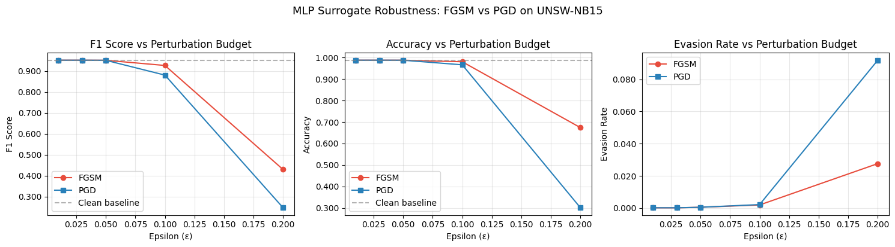

# Adversarial ML Researcher · AI Red Teamer · Agentic Security Engineer

> I break AI systems. Then I build ones that hold.
>
> Every model in this portfolio was attacked after it was trained — with domain-constrained adversarial examples, black-box transfer attacks, and shortcut learning exploitation. The agentic systems were designed from the start assuming a capable adversary controls the input. The same question drives all of it: **can a security system hold when the attacker understands it?**

---

## The Progression

### Stage 1 — Finding Where Models Break

Three classifiers. Three different attack surfaces. The same methodology each time: train the model, use GradCAM to find what it's actually responding to, then exploit it.

**[Fashion-MNIST CNN — Adversarial Robustness](https://github.com/sassom2112/fashionmnist-cnn)**

GradCAM reveals the Shirt classifier has no stable discriminative region — its decision boundary simultaneously borders Pullover, Coat, and T-shirt/top. Any gradient step finds a neighboring class almost instantly. At ε=0.10, accuracy collapses from 82% → 4%. Clean test accuracy: **82.3%**.

---

**[VGG-11 Traffic Sign Classification — Adversarial Robustness](https://github.com/sassom2112/vgg11-traffic-sign-classifier)**

Two-phase fine-tuning of VGG-11 on GTSRB (43 classes, 39K images): frozen backbone 63.9% → full fine-tuning **93.2%**. The 29-point gap is itself a finding — frozen ImageNet features fail to generalize to this visual domain, which means the model's confidence is not grounded in traffic sign geometry.

GradCAM confirms it: the 30 km/h classifier fires on background traffic lights and urban intersection context — not the sign itself. The model learned a proxy for speed limits. That proxy is the attack surface. This is the same failure mode behind physical-world adversarial patches on stop signs.

---

**[Wine Color Classification — Adversarial Analysis](https://github.com/sassom2112/wine-color-classifier)**

EDA → LR vs XGBoost → SHAP → FGSM on 6,497 samples. **F1: 0.9938 · ROC-AUC: 0.9999.** Minimum perturbation to flip a classification: **+0.09 mg/L SO₂** — below winery measurement noise. The model is statistically unassailable; geometrically, it is one imperceptible nudge from failure.

The features SHAP identifies as most important are the exact features FGSM identifies as most exploitable. **Explainability is a roadmap to the attack surface.** Transfer attack: 16.9% of adversarial examples crafted against logistic regression fool XGBoost — black-box evasion with no access to the target model's gradients or architecture.

---

### Stage 2 — Applying It to a Real Security Problem

The same question, on real network intrusion data: *what happens to a detector when an adversary crafts inputs to evade it — and can adversarial training fix that?*

**[Network Intrusion Detection — Adversarial Hardening](https://github.com/sassom2112/network-intrusion-detection)**

**sklearn · XGBoost · PyTorch · FGSM/PGD · SHAP · UNSW-NB15 (2.54M flows)**

Full ML lifecycle: EDA → sklearn Pipeline → XGBoost (F1: **0.9640**, ROC-AUC: **0.9997**) → SHAP explainability → adversarial attack suite → adversarial training.

SHAP TreeExplainer identifies the top features driving XGBoost predictions. Those same features become the primary targets for FGSM and PGD attacks — the explainability work directly informs the threat model.

Attacks are applied with **domain-aware constraint projection**: adversarial flows are constrained to remain physically plausible (no negative packet counts, TTL ∈ [0,255], ports ∈ [0,65535]). Most published FGSM work on IDS ignores this — producing inputs that are impossible on real networks, and conclusions that don't hold operationally.

**Transfer attack via surrogate model**: a PyTorch MLP is trained on the same feature space to approximate the XGBoost decision boundary. Adversarial examples crafted against the surrogate transfer to XGBoost at **16–18%** evasion — a **15× increase in false negatives** over the clean baseline — without accessing the target model's weights or architecture. This is the first step in the operational threat model: an adversary who understands the feature space can evade a deployed classifier they cannot directly inspect.

  

**Key result: Madry PGD adversarial training eliminates the robustness gap with no clean-accuracy cost.**

  

| | Clean F1 | F1 at ε=0.10 | F1 at ε=0.20 |
|---|---|---|---|
| Standard MLP | 0.9519 | 0.8865 | **0.2658** |
| Adversarially Trained MLP | 0.9524 | **0.9520** | **0.9494** |

At ε=0.20 the standard model collapses to F1=0.27 — near-random detection. The hardened model retains **99.7% of clean performance**. No accuracy-robustness tradeoff.

  

---

**[CATT-CCS — Constraint Inflation in Adversarial NIDS Evaluation](https://github.com/sassom2112/catt-ccs)**

*Research paper · ACM CCS 2027 (under preparation)*

**PyTorch · scikit-learn · XGBoost · FGSM/PGD · UNSW-NB15 · CICIDS-2017 · NSL-KDD**

The network intrusion work above revealed that most published adversarial NIDS evaluations run unconstrained gradient attacks — producing inputs with negative TTL values, sub-zero packet counts, and rates outside [0,1] that can never appear on a real network. The reported evasion rates are inflated by how easily the optimizer exploits physically infeasible feature space.

This paper formalizes the problem, builds a reusable constraint projection library, and measures the gap across three classifier architectures (MLP, Random Forest, XGBoost) and three benchmark datasets with three independent random seeds each.

**At ε=0.20 on UNSW-NB15: unconstrained PGD reports 79% evasion. Constrained PGD — the only physically achievable result — reports 7%. The gap is 72 percentage points.**

The gap scales with constraint tightness across datasets (67–72 pp on UNSW-NB15 and NSL-KDD, 12 pp on CICIDS-2017), confirming the mechanism rather than an artifact of any single benchmark. Transfer results reveal that gradient-based surrogate attacks transfer near-perfectly to RF and XGBoost on CICFlowMeter features, but only moderately on mixed-type NIDS features. 65 unit tests, three Colab notebooks, fully reproducible benchmark suite released with the paper.

---

### Stage 3 — The Same Principle at the System Level

An LLM-based security agent faces an analogous threat: an attacker who can write to logs, craft alert metadata, or control file system artifacts can influence what the agent sees and concludes. Prompt-level guardrails are the equivalent of a standard (non-hardened) classifier — they work until the adversary pushes past ε.

The architectural answer at the model level was adversarial training with separation between clean and adversarial loss. The architectural answer at the system level is the same kind of separation: agents that receive findings but not reasoning, auditors that have a mandate to refute rather than confirm, tool servers that validate before any subprocess executes.

---

**[VERITAS — Autonomous Windows Forensic Investigation](https://github.com/sassom2112/veritas)**

*SANS FIND EVIL! Hackathon 2026 · Tested on SIFT Workstation*

**MCP · Windows Forensics · Dual-Agent Architecture · MITRE ATT&CK**

Three-phase pipeline for dead-disk and memory forensics on Windows images:

1. **Deterministic triage** — 25 SIFT commands, corpus-calibrated log-odds scoring across 9 MITRE techniques. No LLM in the loop, no hallucination surface.
2. **Agentic investigation** — Claude Sonnet sequences tool calls like a senior examiner: event logs → prefetch → registry hives → MFT → shellbags → hash verification. Receives raw artifacts only — no Pass 1 scores, no technique labels.
3. **Forensic auditor** — receives the finding list only, no access to prior reasoning. Mandate: assume every finding is a false positive until the filesystem proves otherwise.

Detection rules are trained via **automated Red Teaming**: a Red Agent generates evasion variants of known attack patterns against real Mordor/OTRF Sysmon telemetry; a Blue Agent learns to catch them. 3,000 iterations, 1,245 evasion variants evolved, 83 signals learned — with zero human intervention. The Red Agent is not a data augmentation trick. It is an adversary.

On the nfury test image: triage pass scored 9 techniques. The adversarial auditor confirmed 2, refuted 7. Without architectural separation, 7 false accusations would have entered the report. Prompt instructions do not prevent this. Separation does.

  
  

> A full disk + memory investigation runs in 17 minutes at $14 in API cost. LLMs hallucinate. In forensics, a hallucination is a false accusation. The architecture has to be defensible, not the prompt.

---

**[Elastic IR Agent](https://github.com/sassom2112/Elastic-ir-agent)**

*Elastic Agent Builder × Google Cloud Agent Builder Hackathon 2026*

**Elasticsearch · Gemini · ES|QL · MCP**

Autonomous IR agent with hybrid semantic + ES|QL search over 73,909 real Windows attack events. Write-back memory builds persistent investigation context across sessions — with structural session isolation: `search_memory` is hard-scoped to the current `session_id` at the dispatch layer. The model cannot query across investigations regardless of what it requests. **IOC contamination between cases is blocked architecturally, not by prompt instruction.**

Memory content is sanitized before any Elasticsearch write — control characters stripped, input capped at 10,000 chars — explicitly to block indirect prompt injection via poisoned retrieval. An independent Forensic Auditor pass re-queries Elastic with read-only tools and labels every MITRE claim VERIFIED / REFUTED / UNVERIFIABLE with raw event evidence.

---

**[Splunk IR Agent](https://github.com/sassom2112/splunk-agentic-ir)**

*Splunk Agentic Ops Hackathon 2026*

**Splunk · MITRE ATT&CK · SPL · Python**

End-to-end autonomous incident investigation triggered by a single alert — brute force, lateral movement, credential access, mapped to MITRE ATT&CK, IR report generated before an analyst opens their laptop.

The security boundary treats the model as untrusted input. All six SPL templates are read-only `search` queries — no `collect`, `outputlookup`, or write-back commands exist anywhere in the codebase. Format-substituted fields are validated before insertion: `earliest`/`latest` against a strict regex allowlist, `index` against `[a-zA-Z0-9_\-]` only. A malicious model output cannot append `| outputlookup evil` to a query. The tool dispatch allowlist blocks unknown tool names before any Splunk call executes.

---

## Foundations

| Project | What it demonstrates |
|---------|---------------------|
| [Gradient Descent from Scratch](https://github.com/sassom2112/regression-optimization) | Manual gradient descent vs. autograd — what optimizers actually compute, no black box |
| [GAN: Oxford Flowers](https://github.com/sassom2112/oxford-flowers-gan) | Adversarial training dynamics: generator vs. discriminator across 250 epochs |

**MIT xPro — Deep Learning: Mastering Neural Networks** 

---

## Deployed Applications

**[MNIST Digit Recognition](https://github.com/sassom2112/mnist-digit-recognition)** · 

Draw a digit → Flask API → PyTorch CNN → per-digit confidence scores + Conv layer filter visualization in real time. Deployed on AWS (Lambda + API Gateway + CloudFront), containerized with Docker.

 

**[LSTM Text Generation](https://github.com/sassom2112/lstm-text-prediction)** · 

Prompt → two-layer PyTorch LSTM → top-10 next-word probabilities. Intentionally undertrained to demonstrate why attention mechanisms exist. Deployed on Render.

---

