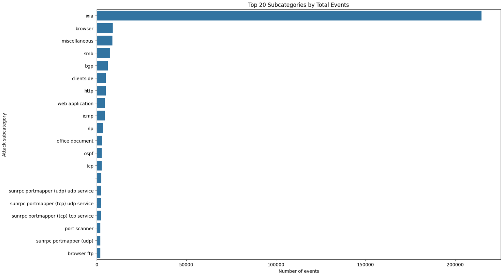
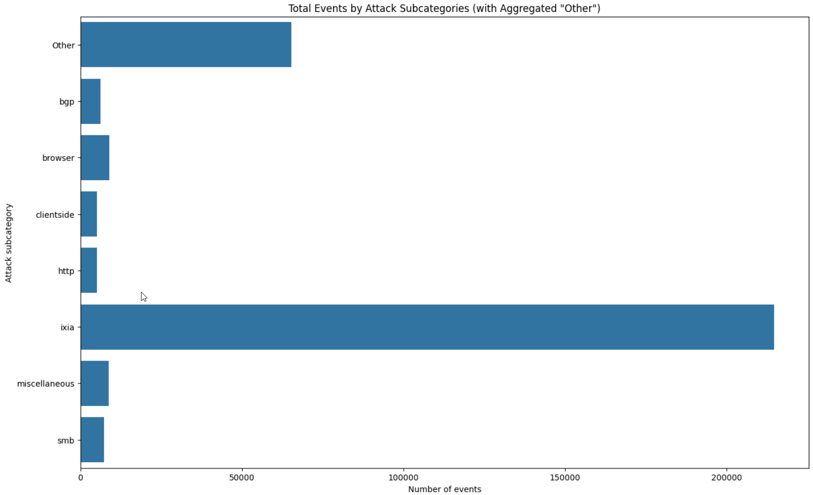

# Cybersecurity & Machine Learning Specialist | Security-Driven ML Innovator

## 🔐 Cybersecurity Projects

- [Exploratory Data Analysis and Preprocessing of the UNSW-NB15 Network Traffic Dataset](https://github.com/sassom2112/congenial-lamp)  
  This project involves the exploratory data analysis (EDA) and preprocessing of the UNSW-NB15 dataset, which contains network traffic data for intrusion detection. The analysis includes cleaning, feature engineering, and visualizing distributions to prepare the dataset for modeling and further investigation of network security threats.
 
  
  

- [Password Cracker](https://github.com/sassom2112/ideal-rotary-phone.git) - A project that demonstrates unix_crypt(3) and modern SHA512 salting approaches. Highlights the importance of strong hashing and salting practices.
  
- [TCP Scanner](https://github.com/sassom2112/shiny-octo-happiness.git) - A project that demonstrates how to scan TCP ports on a target host and retrieve service banners from open ports. It highlights the importance of network reconnaissance techniques for identifying open services and securing network infrastructure.

- [Windows Memory Management](https://github.com/sassom2112/Windows-Memory-Management) - A project that demonstrates the significance in properly freeing memory to prevent leaks.

## 🔬 Machine Learning Projects
### **MIT xPro** - Deep Learning: Mastering Neural Networks

- [Adapting and Training VGG-11 for Traffic Sign Recognition](https://github.com/sassom2112/scaling-guide) - This project adapts and trains a pretrained VGG-11 neural network for traffic sign classification using the GTSRB dataset. Through a two-phase approach—feature extraction and fine-tuning—the model leverages transfer learning to achieve high accuracy in recognizing 43 traffic sign classes.

- [Adversarial Image Generation: Flowers Dataset with GANs](https://github.com/sassom2112/urban-eureka) - 
This project uses Generative Adversarial Networks (GANs) to create realistic images of flowers, leveraging the Oxford 102 Flowers Dataset. The adversarial training process enables the Generator to synthesize high-quality images while the Discriminator learns to distinguish real from fake, resulting in visually convincing outputs.

- [LSTM-Based Text Generation for Sequence Learning](https://github.com/sassom2112/bug-free-fortnight) - 
This project trains a Long Short-Term Memory (LSTM) model to predict and generate word sequences based on input text, using a bilingual English-to-Spanish dataset for sequence modeling. It includes data preprocessing, one-hot encoding, and regularization techniques to ensure accurate predictions and robust performance.

- [FashionMNIST Classifcation Project](https://github.com/sassom2112/bookish-dollop) - This project trains a Convolutional Neural Network (CNN) to classify images from the FashionMNIST dataset into 10 clothing and footwear categories, using PyTorch for model implementation, training, and evaluation. It includes data augmentation, performance visualization, and confusion matrix analysis to ensure robust classification and meaningful insights.

- [Regression Optimization](https://github.com/sassom2112/module_1_regression_optimization) - This linear regression project explores manually fitting vs automatic fitting using gradient descent optimization for linear regression.

- [Training a Single Neuron Classifier](https://github.com/sassom2112/fuzzy-palm-tree.git) - This logistic regression project addresses a binary classification problem, predicting wine color (red or white) based on chemical features like acidity and alcohol content. It compares two approaches: manual implementation vs. scikit-learn, demonstrating the convenience and efficiency of using pre-built machine learning tools.
  
- [MNIST Digit Recognition App](https://github.com/sassom2112/friendly-octo-tribble) - This project is a full-stack web application that uses a Convolutional Neural Network (CNN) to recognize handwritten digits from the MNIST dataset. The app allows users to draw a digit on a canvas, which is processed by a Flask API for real-time digit classification.

## 🌐 Web Projects

- [Contact Management](https://github.com/sassom2112/reimagined-carnival.git) - A contact management system that uses **Firebase Firestore** for real-time CRUD operations, allowing users to add, edit, delete, and search contacts. It features a responsive design, ensuring smooth functionality across both desktop and mobile devices.

- [Packing List App](https://github.com/sassom2112/fictional-spoon) - A **React-based** packing list app that allows users to add, remove, and toggle the packed status of items for a trip. It displays real-time statistics on the total number of items and how many have been packed, providing an easy way to manage travel preparations.

## Technologies Used

